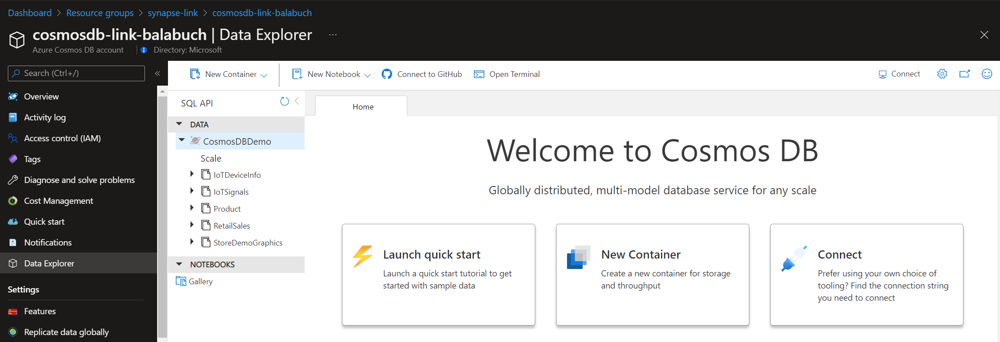
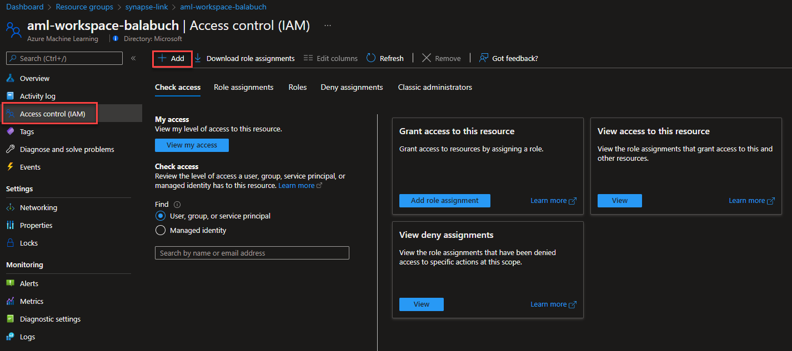
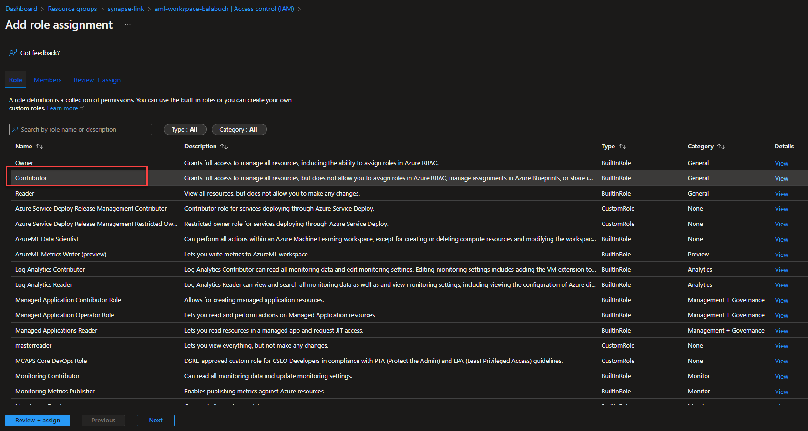
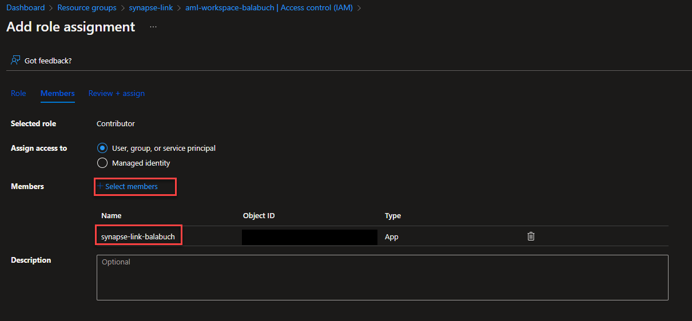

# Deploy the solution

In this section you will provision all Azure resources required to complete labs. We will use a pre-defined ARM template with the definition of all Azure services used to ingest, store, process and visualize data.

## Azure Services used in this lab

There will be a few resources to support an Azure Synapse link for CosmosDB:

- An Azure Resource Group
- An Azure Synapse Workspace
- An Azure Synapse SQL Pool **rever**
- An Azure Synapse Spark Pool
- An Azure Data Lake Storage Gen2 account
- A key vault to store the secrets
- Cosmos DB account - Core (SQL)
- CosmosDB Database (CosmosDemoDB)
- CosmosDB Containers with Analytical Store Enabled
  - Products
  - StoreDemoGraphics
  - RetailSales
  - IoTDeviceInfo
  - IoTSignals
- AML workspace
- Azure Cognitive Service
- PySpark Notebook to:
  - Ingest batch data into CosmosDB containers
  - Fetch data from CosmosDB
  - Join dataset together
  - Perform Sales Forecasting using Azure Synapse Link and Azure Machine Learning
- PySpark Notebook to:
  - Ingest stream and batch data into CosmosDB containers
  - Fetch data from CosmosDB
  - Join dataset together
  - Perform Anomaly Detection using Azure Synapse Link and Azure Cognitive Services on Synapse Spark Pool (MMLSpark)

## Azure services provisioned for the workshop

Some of the Azure services provisioned require globally unique name and a “-suffix” has been added to their names to ensure this uniqueness.

> [!CAUTION]
> Make sure you deploy all the resources in the correct order

| Order | Azure Service | Name   | Pricing Tier    | How to |
| :--:  |:----          |:----- | :----   |:----- |
| 1     | Resource Group | synapse-link |   | [Create a Resource Group](https://docs.microsoft.com/en-us/azure/azure-resource-manager/management/manage-resource-groups-portal#create-resource-groups)
| 2     | Storage Account Data Lake Gen 2| synapsedatalake*suffix* |    |[Create an Azure Data Lake Storage Gen2 account](https://docs.microsoft.com/en-us/azure/storage/blobs/create-data-lake-storage-account)|
| 3 | Storage Account | synapselinkml*suffix* | | [Create a storage account](https://docs.microsoft.com/en-us/azure/storage/common/storage-account-create?toc=%2Fazure%2Fstorage%2Fblobs%2Ftoc.json&tabs=azure-portal)|
| 3     |Anomaly Detector| anomaly-detector-*suffix* | Free  |[Create an Azure Cognitive Service Anomaly Detector](https://docs.microsoft.com/en-us/azure/cognitive-services/anomaly-detector/how-to/deploy-anomaly-detection-on-iot-edge#create-an-anomaly-detector-resource)|
| 4     |Azure Synapse Analytics |  synapse-link-*suffix* | |[Create an Azure Synapse Analytics](https://docs.microsoft.com/en-us/azure/synapse-analytics/quickstart-create-workspace)|
| 5     | Azure Cosmos DB| cosmosdb-link-*suffix* | 4000 RU/sec |[Create an Azure Cosmos DB account](https://docs.microsoft.com/en-us/azure/cosmos-db/sql/create-cosmosdb-resources-portal#create-an-azure-cosmos-db-account)|
| 6     |Azure Key Vault|  key-vault-*suffix* | Standard |[Create an Azure Key Vault](https://docs.microsoft.com/en-us/azure/key-vault/general/quick-create-portal)|
| 7 | Log Analytics Workspace | log-analytics-*suffix*| | [Create a Log Analytics workspace](https://docs.microsoft.com/en-us/azure/azure-monitor/logs/quick-create-workspace?tabs=azure-portal)|
| 7 | Application Insights | application-insights-*suffix*||[Create an Application Insights](https://docs.microsoft.com/en-us/azure/azure-monitor/app/create-new-resource)
| 7| Azure Machine Learning |aml-workspace-*suffix*  | a |[Create as Azure Machine Learning Workspace](https://docs.microsoft.com/en-us/azure/machine-learning/quickstart-create-resources)|

### Azure Machine Learning deployment

When deploying a Azure Machine Learning make sure to use:

- **Storage account**: synapselinkml*suffix*
- **Key Vault**: key-vault-*suffix*
- **Application Insights**: application-insights-*suffix*

After deploying all Azure services, it's time to set up some other resources like enable Synapse Link for Cosmos DB, Cosmos DB Database and containers and Spark Pool.

### Enable Synapse Link for Cosmos DB

Synapse Link creates a tight seamless integration between Azure Cosmos DB and Azure Synapse Analytics.

[Enable Synapse Link for Cosmos DB](https://docs.microsoft.com/en-us/azure/cosmos-db/configure-synapse-link#enable-synapse-link)

### Create a Azure Cosmos DB Database and container

1. Start creating a new database into your Cosmos DB account. [How to create a database and container in Azure Cosmos DB SQL API](https://docs.microsoft.com/en-us/azure/cosmos-db/configure-synapse-link#create-analytical-ttl)

   - **Database id**: CosmosDBDemo
   - **Share throughput across containers:** Enable
   - **Database throughput(autoscale)**: Autoscale
   - **Database Max RU/s**: 4000

2. Now, you have to create five containers:

   - *IoTDeviceInfo*
     - Partition Key: /id
     - ***Analytical store***: ON
   - *IoTSignals*
     - Partition Key: /id
     - ***Analytical store***: ON
   - *Product*
     - Partition Key: /id
     - ***Analytical store***: ON
   - *RetailSales*
     - Partition Key: /id
     - ***Analytical store***: ON
   - *StoreDemoGraphics*
     - Partition Key: /id
     - ***Analytical store***: ON

> [!WARNING]
>
> Keep in mind that in all container you must enable analytical store

### Create a Spark pool

Apache Spark is a parallel processing framework that supports in-memory processing to boost the performance of big data analytic applications and
An Apache Spark pool provides open-source big data compute capabilities.

1. Start creating two Apache Spark pool into you Azure Synapse Analytics workspace. [Create a new serverless Apache Spark pool](https://docs.microsoft.com/en-us/azure/synapse-analytics/quickstart-create-apache-spark-pool-portal).

- **Apache Spark pool name**: demoaml
- **Node size family**: Memory Optimized
- **Node size**: Medium (8 vCores / 64 GB)
- **Autoscale**: Enable
- **Automatic pausing**: Enable
- **Apache Spark**: 2.4

Unfortunately, Spark 2.4 is a prerequisite from [train a machine learning model](https://docs.microsoft.com/en-us/azure/synapse-analytics/machine-learning/tutorial-automl#prerequisites)

- **Apache Spark pool name**: demo
- **Node size family**: Memory Optimized
- **Node size**: Medium (8 vCores / 64 GB)
- **Autoscale**: Enable
- **Automatic pausing**: Enable
- **Apache Spark**: 3.2

### Granting permission for Azure Synapse Analytics

Now, you have to grant permission for Azure Synapse Analytics workspace to access the Azure Machine Learning Workspace.

[Give MSI permission to the Azure ML workspace](https://docs.microsoft.com/en-us/azure/synapse-analytics/machine-learning/quickstart-integrate-azure-machine-learning#give-msi-permission-to-the-azure-ml-workspace)

1. Open your Azure Machine Learning resource
2. Navigate to 'Access control (IAM)' section in the left panel and then click '*+ Add*'.

3. Select '*Add role assignment*'
4. Select '*Contributor*' role anc click '*Next*'

5. Select '*+ Select members*' and find out the Azure Synapse Analytics Workspace (synapse-link-*suffix*) you created previously.

6. Click '*Review + assign*'

> [!IMPORTANT]
> We will create a linked services during the lab.

## One click deploy

Create ARM Template

## Post Deployment

After the deployment is complete, click 'Go to resource group'.
You'll see all the resources deployed in the resource group.
