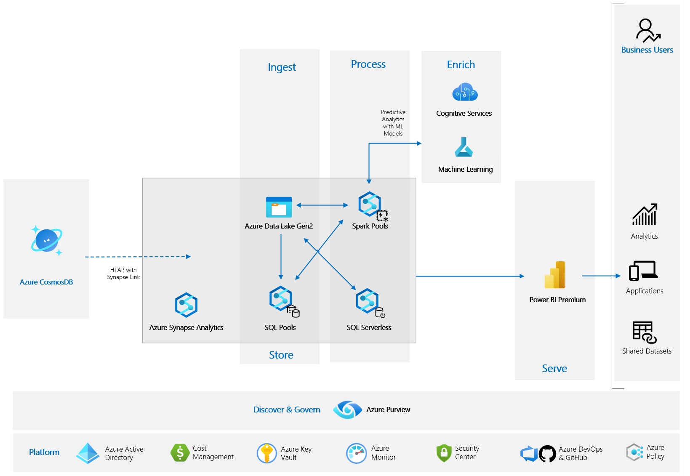

# Lab - Synapse Link for Cosmos DB

> [!NOTE]
> This lab was built based on this [Microsoft repository](https://github.com/Azure/Test-Drive-Synapse-Link-For-CosmosDB-With-1-Click)

In this lab, you will walk through a complete end-to-end scenario to analyze large operational datasets while minimizing the impact on the performance of mission-critical transactional workloads,
Using [Azure Cosmos DB analytical store](https://docs.microsoft.com/en-us/azure/cosmos-db/analytical-store-introduction), a fully isolated column store, Azure Synapse Link enables no Extract-Transform-Load (ETL) analytics in Azure Synapse Analytics against your operational data at scale.

You will configure the Azure environment to allow data to be transferred from an Azure Cosmos DB to an Azure Synapse Analytics Workspace using Azure Synapse Link for Cosmos DB. You will also ingest data into Cosmos DB, explore spark pool together with Azure Machine Learning and Azure Cognitive Services on Synapse Spark (MMLSpark).

## Microsoft Learn & Technical Documentation

| Azure Services | Microsoft Learn | Technical documentation |
|:-------------- |:--------------- |:----------------------- |
| Azure Cosmos DB | [Explore Azure Cosmos db](https://docs.microsoft.com/en-us/learn/modules/explore-azure-cosmos-db/)| [Cosmos DB Technical documentation](https://docs.microsoft.com/en-us/azure/cosmos-db/)|
|Azure Synapse Analytics | [Implement a Data Warehouse with Azure Synapse Analytics](https://docs.microsoft.com/en-us/learn/paths/realize-integrated-analytical-solutions-with-azure-synapse-analytics)| [Azure Synapse Analytics Technical Documentation](https://docs.microsoft.com/en-us/azure/synapse-analytics/)|
|Azure Data Lake Storage Gen2 | [Large Scale Data Processing with Azure Data Lake Storage Gen2](https://docs.microsoft.com/en-us/learn/paths/data-processing-with-azure-adls) | [Azure Data Lake Storage Gen2 Technical Documentation](https://docs.microsoft.com/en-us/azure/storage/blobs/data-lake-storage-introduction)|
|Azure Cognitive Anomaly Detector Services| [Introduction to Anomaly Detector](https://docs.microsoft.com/en-us/learn/modules/intro-to-anomaly-detector/)| [Azure Cognitive Anomaly Detector Technical Documentation](https://docs.microsoft.com/en-us/azure/cognitive-services/anomaly-detector/)|
|Azure Machine Learning |[Build and operate machine learning solutions with Azure Machine Learning](https://docs.microsoft.com/en-us/learn/paths/build-ai-solutions-with-azure-ml-service/)| [Azure Machine Learning Technical Documentation](https://docs.microsoft.com/en-us/azure/machine-learning/)|
|Azure Key Vault    |[Configure and manage secrets in Azure Key Vault](https://docs.microsoft.com/bs-latn-ba/learn/modules/configure-and-manage-azure-key-vault/)   |[Azure Key Vault Technical Documentation](https://docs.microsoft.com/en-us/azure/key-vault/)|

# Lab architecture

- STEP 1 - Configuring linked services for Azure ML
- STEP 1 - Configuring Synapse Link for CosmosDB
- STEP 2 - Navigating through Cosmos DB using Synapse Link
- STEP  -  Exploring data using Apache Spark Pool
- STEP  - Exploring data using SQL Serverless Pool

## Configuring linked services for Azure ML

[Create an Azure ML linked service](https://docs.microsoft.com/en-us/azure/synapse-analytics/machine-learning/quickstart-integrate-azure-machine-learning#create-an-azure-ml-linked-service)

1. In Synapse Studio click on the 'Manage' icon in the left panel and navigate to 'Linked Services' menu option and click '*+New*'.

2. Choose "Azure Machine Learning" click '*Continue*' to open up configuration settings.

3. Name: **AzureMLServices**
4. Connect via IR: **AutoResoveIntegrationRuntime**
5. Authentication type: **System Assigned Managed Identity**
6. Account selection method: **From Azure Subscription**
   1. Azure Subscription: **Use your subscription**
   2. Azure Machine Learning workspace name: **aml-workspace-*suffix***
7. Click Test connection
8. Click '*Create*' to save the changes.

## Configuring Synapse Link for CosmosDB

1. In Synapse Studio click on the 'Manage' icon in the left panel and navigate to 'Linked Services' menu option and click '*+New*'.

2. Choose Azure Cosmos DB (SQL API) and click '*Continue*' to open up configuration settings.

3. Name: **CosmosDBLink**
4. Connect via IR: **AutoResoveIntegrationRuntime**
5. Authentication type: **Account Key**
6. Account selection method: **From Azure Subscription**
   1. Azure Subscription: **Use your subscription**
   2. Azure Cosmos DB account name: **cosmosdb-link-*suffix***
   3. Database Name: **CosmosDBDemo**
7. Click Test connection
8. Click '*Create*' to save the changes

### Validating Synapse Link for Cosmos DB

Let's double-check and verify if Cosmos DB Analytical store and containers are correctly setting up.

**In Cosmos DB account**

1. Navigate to 'Features' tab.
2. Synapse Link will appear as Enabled option.

**In Azure Synapse Analytics Studio**

1. Navigate to 'Data' section in the left panel and then to the 'Linked' menu option.
2. Expand 'Azure CosmosDB', There will be five containers listed with 'Analytical Store' enabled.

## Configuring linked services for Azure Key Vault

1. In Synapse Studio click on the 'Manage' icon in the left panel and navigate to 'Linked Services' menu option and click '*+New*'.

2. Choose "Azure Key Vault" click '*Continue*' to open up configuration settings.

3. Name: **AzureKeyVault**
4. Account selection method: **From Azure Subscription**
   1. Azure Subscription: **Use your subscription**
   2. Azure key vault name: **key-vault-*suffix***
5. Authentication type: **System Assigned Managed Identity**
6. Click Test connection
7. Click '*Create*' to save the changes.

## Configuring linked services for Azure Cognitive Service

There are a few prerequisites before [configuring a linked services for Azure Cognitive Services](https://docs.microsoft.com/en-us/azure/synapse-analytics/machine-learning/tutorial-configure-cognitive-services-synapse) and we have already completed a few of them.

> [!NOTE]
> Azure Cognitive Services and Azure Key vault were already created, you can skip this step.

- [Create a Cognitive Services resource](https://docs.microsoft.com/en-us/azure/synapse-analytics/machine-learning/tutorial-configure-cognitive-services-synapse#create-a-cognitive-services-resource)
  
- [Create a key vault and configure secrets and access](https://docs.microsoft.com/en-us/azure/synapse-analytics/machine-learning/tutorial-configure-cognitive-services-synapse#create-a-key-vault-and-configure-secrets-and-access)

It's time to configure secrets and access.

1. In Azure Key Vault click on the 'Access Police' in the left panel and grant the Azure Synapse workspace MSI permission to read secrets from Azure Key Vault.
    
2. Configure from template: Key Secret & Certificate Management
3. Select principal: synapse-link-*suffix*
    
4. Click "*Select*" and then "*Add*"
5. Click "Save"
6. Go to your Cognitive Services Anomaly Detector resource, in the left panel click *Keys and Endpoint*.
7. Then copy either of the two keys to the clipboard.
8. Now, go back to Azure Key Vault, in the left panel click "*Secrets*"
9. Click "Generate/Import" to create a new secret.
10. Upload options: **Manual**
11. Name: **AnamolyDetectorKey**
12. Value: **paste the key from the step 7**
13. Click *Create*

### Finally, lets create an Azure Cognitive Service linked service

1. In Synapse Studio click on the 'Manage' icon in the left panel and navigate to 'Linked Services' menu option and click '*+New*'.

2. Choose "Azure Cognitive Services" click '*Continue*' to open up configuration settings.
3. Name: **CongitiveServicesLink**
4. Connect via IR: **AutoResoveIntegrationRuntime**
5. Authentication type: **Account Key**
6. Azure Cognitive Services selection method: **From Azure Subscription**
   1. Azure Subscription: **Use your subscription**
   2. Azure Cognitive Services name: **anomaly-detector-*suffix***
   3. AKV linked service: **AzureKeyVault**
   4. Secret name: **AnomalyDetectorKey**
   5. Secret version: **Latest version**
7. Click '*Create*' to save the changes

> [!TIP]
> Do not forget to Publish All

### Notebooks

Notebooks contain both computer code (e.g. python) and rich text elements (paragraph, equations, figures, links, etc…). Notebooks are both human-readable documents containing the analysis description and the results (figures, tables, etc..) as well as executable documents which can be run to perform data analysis.
They are an essential tool for data, prototyping, and learning!

[Create, develop, and maintain Synapse notebooks in Azure Synapse Analytics](https://docs.microsoft.com/en-us/azure/synapse-analytics/spark/apache-spark-development-using-notebooks)

There are two notebooks to you explore and learn:

- **Sales forecasting with Auto ML**
- **IoT Anomaly Detection with Synapse ML**

First lets [import](https://docs.microsoft.com/en-us/azure/synapse-analytics/spark/apache-spark-development-using-notebooks#create-a-notebook)  these notebooks into the Azure Synapse Analytics workspace.

> [!TIP]
> Do not forget to Publish All

In Synapse Studio click on the 'Develop' icon in the left panel and navigate to the 'Notebooks' section.

In these notebooks we are going to leverage the power of Azure Synapse Link for Cosmos DB using PySpark.
With Synapse Link, you can now directly connect to your Azure Cosmos DB containers from Azure Synapse Analytics and access the analytical store with no separate connectors.

Let's start with the first notebook - Sales forecasting with Auto ML

#### Sales forecasting with Auto ML

This notebook will cover:

- Ingest data into Cosmos DB containers using Azure Synapse link
- Create a Spark table over Cosmos DB analytical store
- Join & aggregate operational data across Cosmos DB containers
- Perform near real-time Sales forecasting using Azure Automated Machine Learning with Synapse Link for Cosmos DB

_**This notebood uses Spark 2.4**_ - Attach to **demoaml** Apache Spark Pool

### IoT Anomaly Detection with Synapse ML

This notebook will cover:

- Ingest streaming data into Azure Cosmos DB collection using Structured Streaming
- Ingest batch data into Azure Cosmos DB collection using Azure Synapse Spark Pool
- Format the stream dataframe as per the IoTSignals schema
- Write the streaming dataframe to the Azure Cosmos DB collection
- Perform joins and aggregations across Azure Cosmos DB collections using Azure Synapse Link
- Perform Anomaly Detection using Azure Synapse Link, Azure Cognitive Services and Synapse ML

_**This notebood uses Spark 3.2**_ - Attach to **demo** Apache Spark Pool
